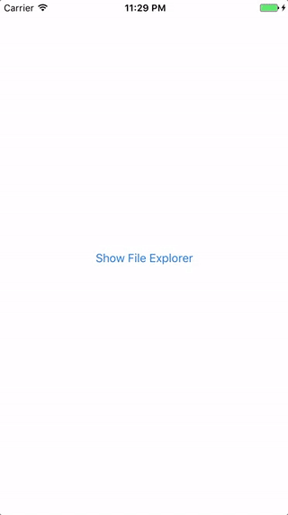
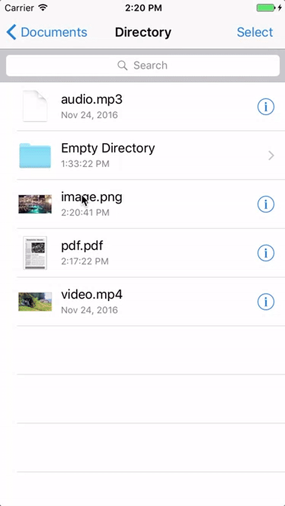
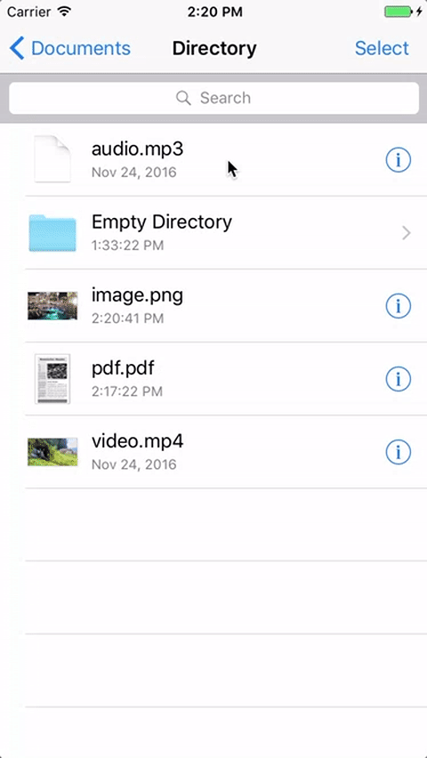
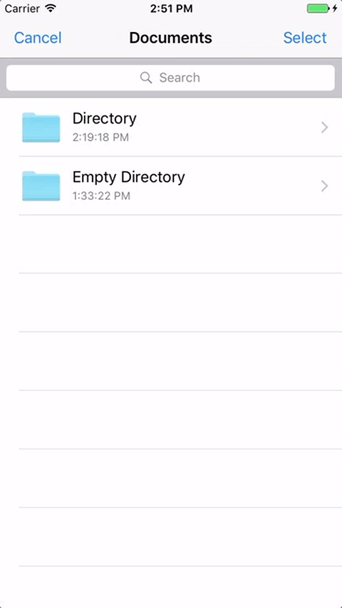

FileExplorer (iOS 10.0+)
==============

👷 Project created and maintained by [Rafał Augustyniak](http://augustyniak.me). You can find me on twitter ([@RaAugustyniak](https://twitter.com/RaAugustyniak)).


Introduction
-----------------

[](https://twitter.com/raaugustyniak)
[](https://github.com/Augustyniak/FileExplorer)
[](http://cocoadocs.org/docsets/FileExplorer)
[](https://github.com/Augustyniak/FileExplorer/blob/master/LICENCE.md)
[]()




FileExplorer is a control designed to provide an easy way to browse and interact with local file system on iOS devices. It works as file browser with additional possibility of deleting specified files and/or directories and possibility to choose files and/or directories.


         | Main Features
---------|---------------
👉 | Possibility to choose files or/and directories if there is a need for that
🗑 | Possiblity to remove files or/and directories if there is a need for that
&#128269; | Built-in search functionality
📚 | Documented
&#127968; | Out of the box support for image, audio, video and pdf files
&#128640; | Extendable API; Possibility to add support for any file type
&#128038; | Written in Swift


Images             |  Audio Files | Videos | Directories  | PDFs | Preview
:-------------------------:|:-------------------------:|:-------------------------:|:-------------------------:|:-------------------------:|:-------------------------:
 |  |  |  |  | 

Table of Contents:
-----------------

* [Installation](installation)
* [Basic Usage](#basic-usage)
* [Customizations](#customizations)
	* [Deciding Which Files and/or Directories Should Be Visible](#deciding-which-files-andor-directories-should-be-visible)
	* [Using FileExplorer as a Way to Choose Files and/or Directories](#using-fileexplorer-as-a-way-to-choose-files-andor-directories)
	* [Deciding Whether User Can Delete Files and/or Directories
](#deciding-whether-user-can-delete-files-andor-directories)
* [Adding Support for Additional File Types
](#adding-support-for-additional-file-types)
* [Documentation](#documentation)


Installation
-----------------

### CocoaPods

[CocoaPods](http://www.cocoapods.org) is the recommended way to add FileExplorer to your project.

1. Add additional entry to your Podfile.

  ```ruby
  pod "FileExplorer", "~> 1.0.0"
  ```

2. Install Pod(s) running `pod install` command.
3. Include FileExplorer using `import FileExplorer`.

### Source files

1. Downloaded the latest version of the library using [link](https://github.com/Augustyniak/FileExplorer/archive/master.zip).
2. Copy content of the downloaded (and unzipped) zip file into your project by dragging it into Project's navigator files structure.


Basic Usage
-----------------


Check out the demo for example usage of library. Make sure you read the [FileExplorer documentation on Cocoa Docs](http://cocoadocs.org/docsets/FileExplorer/1.0.0).


### Basics

1. Add following import in file of your project when you want to use RATreeView:

   ```Swift
   import FileExplorer
   ```

2. Simplest way to present File Explorer:

   ```Swift
	let fileExplorer = FileExplorerViewController()
   self.present(fileExplorer, animated: true, completion: nil)
   ```

Customizations
-----------------


FileExplorer allows for a lot of customizations. Some of them are discussed below.

### Deciding Which Files and/or Directories Should Be Visible

`FileExplorerViewController` has filters (`fileFilters` and `ignoredFileFilters` properties) which can be used to select which files or directories should or shouldn't be displayed to the user.

Specify which files **should** be visible to the user:

```Swift
let fileExplorer = FileExplorerViewController()

//Only files with `txt` and `jpg` extensions will be visible
fileExplorer.fileFilters = [Filter.extension("txt"), Filter.extension("jpg")]

self.present(fileExplorer, animated: true, completion: nil)
```

Specify which files **should not** be visible to the user:

```Swift
let fileExplorer = FileExplorerViewController()

//Everything but directories will be visible
fileExplorer.ignoredFileFilters = [Filter.type(.directory)]

self.present(fileExplorer, animated: true, completion: nil)
```

Combining both types of filters:

```Swift
let fileExplorer = FileExplorerViewController()

//Only files with `.txt` extension that were modified prior to `referenceDate` will be visible
fileExplorer.fileFilters = [Filter.extension("txt")]
fileExplorer.ignoredFileFilters = [Filter.Filter.modificationDatePastOrEqualTo(referenceDate)]

self.present(fileExplorer, animated: true, completion: nil)
```

### Using FileExplorer as a Way to Choose Files and/or Directories

Configure `FileExplorer` so that user is allowed to choose files and/or directories:

```Swift
let fileExplorer = FileExplorerViewController()
fileExplorer.canChooseFiles = true //specify whether user is allowed to choose files
fileExplorer.canChooseDirectories = false //specify whether user is allowed to choose directories
fileExplorer.allowsMultipleSelection = true //specify whether user is allowed to choose multiple files and/or directories
fileExplorer.delegate = self

self.present(fileExplorer, animated: true, completion: nil)
```

You are informed about choosen files by delegate callback:

```Swift
public func fileExplorerViewController(_ controller: FileExplorerViewController, didChooseURLs urls: [URL]) {
	//Your code here
}
```

### Deciding Whether User Can Delete Files and/or Directories

Configure `FileExplorer` so that user is allowed to remove files and/or directories:

```Swift
let fileExplorer = FileExplorerViewController()
fileExplorer.canRemoveFiles = true //specify whether user is allowed to remove files
fileExplorer.canRemoveDirectories = false //specify whether user is allowed to remove directories

self.present(fileExplorer, animated: true, completion: nil)
```

Adding Support for Additional File Types
-----------------


`FileExplorer` was built with expansibility in mind. It allows its users to register their own file types and provide thumbnails and preview view controllers for them. The whole process is simple and straightforward.

It starts with the implementation of class that conforms to `FileSpecificationProvider` protocol.

   ```Swift
class CustomFileSpecificationProvider: FileSpecificationProvider {
   public class var extensions: [String] {
      return ["foo"]
   }

   public class func thumbnail(forItemAt url: URL, with size: CGSize) -> UIImage? {
      return nil; // FileExplorer uses default thumbnail if nil is returned
   }

   public class func viewControllerForItem(at url: URL, data: Data?, attributes: FileAttributes) -> UIViewController {
      let viewController = CustomViewController()
      //configure your custom view controller here
      return viewController
   }
}
   ```

After that, created class must be registered in an instance of `FileExplorerViewController` class:

```Swift
let fileExplorer = FileExplorerViewController()
fileExplorer.fileSpecificationProviders = [CustomFileSpecificationProvider.self]

self.present(fileExplorer, animated: true, completion: nil)
```

That's all! From now on instance of `FileExplorerViewController` uses `CustomFileSpecificationProvider` to provide thumbnails and view controllers for files with `foo` extension.


Documentation
-----------------

Documentation is available on [CocoaPods](http://cocoadocs.org/docsets/FileExplorer/1.0.0).

Author
-----------------

FileExplorer was created by Rafał Augustyniak. You can find me on twitter ([@RaAugustyniak](https://twitter.com/RaAugustyniak)).

License
-----------------

MIT licensed, Copyright (c) 2016 Rafał Augustyniak, [@RaAugustyniak](http://twitter.com/RaAugustyniak)
